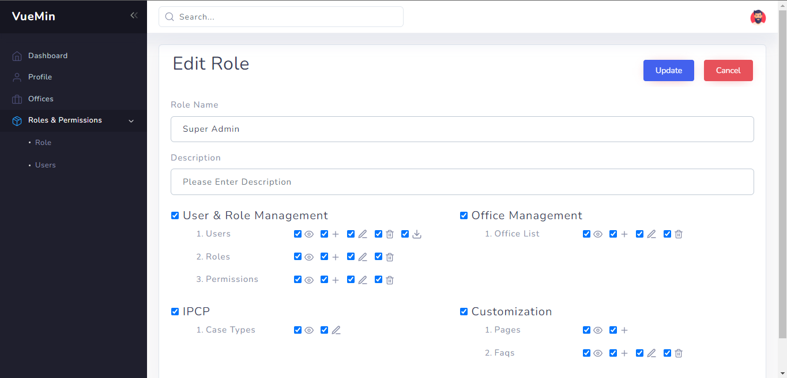
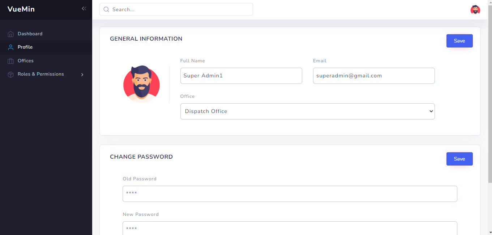
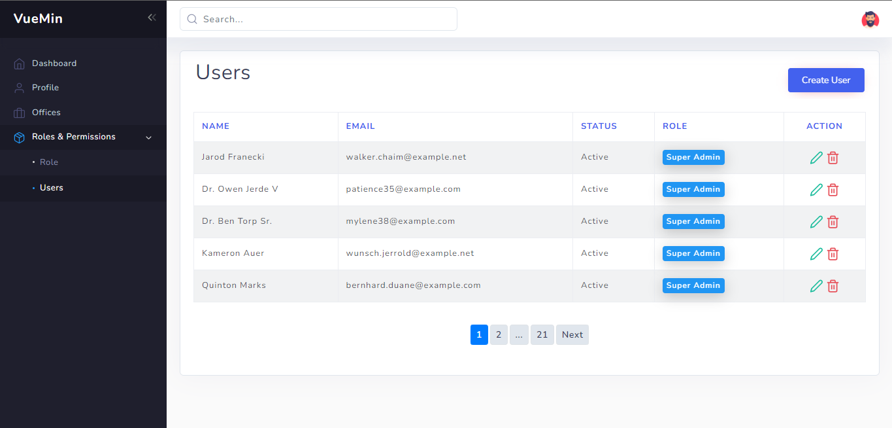

# LaraMin - Zero Config Admin Boilerplate with Laravel and Sanctum

LaraMin is a zero-config Admin boilerplate with Laravel Sanctum and comes with excellent user, office , role management and  `ACL` features out of the box. Start your next big project with vuemin, focus on building business logic, and save countless hours of implementing boring user and role management again and again


## Features

    1. Laravel 9 Framework
    2. Simple role, permission ACL for Laravel Framework
    3. Office Management
    4. User Manage
    5. Laravel Debugbar
    5. Laravel Queue and job scheduling
    5. Redis as cache server
    6. Laravel Sanctum Authentication
    7. Followed Reposityory Pattern
    8. Laravel Pagination






## Requirements

- PHP >= 8.0
- BCMath PHP Extension
- Ctype PHP Extension
- cURL PHP Extension
- DOM PHP Extension
- Fileinfo PHP Extension
- JSON PHP Extension
- Mbstring PHP Extension
- OpenSSL PHP Extension
- PCRE PHP Extension
- PDO PHP Extension
- Tokenizer PHP Extension
- XML PHP Extension

### Installation

    1. Clone the project using git clone   
    2. Copy .env file from .env.example file    
    3. Update .env file by adding database information like DB_HOST.  
    4. Go to project root folder.Open git bash or terminal and run  composer install       
    5. Run php artisan key:generate in the terminal    
    6. Run php artisan migrate --seed


### Troubleshootings

    1. Change Db port in config/database.php file or change as yours.
    2. Try composer composer dump-autoload if need
    3. php artisan config:cache if need
    4. php artisan clear-compiled if need    

### Note*

    Don't delete or edit already added permissions to avoid error   

### Login
         // super admin
         email : superadmin@admin.com
         pass :  password
         
         // officer
         email:officer@gmail.com
         pass : password

## ACL Pattern

We will follow module name singular and table name laravel default (plural) maintain snake case as laravel maintain for table name:

`module_name.table_name.ability`

For example: 
- `user-role-management.users.index`
- `office_management.offices.index  `

We need to follow laravel default route naming pattern if you don't want to follow laravel default then follow our `ACL` Pattern strictly

Here is some example for routes and acl 

```
Route::middleware(['auth:sanctum','acl:office_management'])->group(function () {
    Route::apiResource('/category-types',   CategoryTypeController::class);

});
```
**Here we have pass module name as param like `acl:module_name`**

Laravel will automatically generate routes like this 
- `category-types.index `
- `category-types.show `
- `category-types.store `
- `category-types.destroy `

Our ACL Middleware will handle route name snake case automatically like `category_types.index`


**Here is the snippet of middleware `CheckPermission`**

```
public function handle(Request $request, Closure $next, $module = null)
    {

        $user = $request->user();
        $routeName = request()->route()->getName();
        $askingFeature = $module.'.'.$routeName;
        $askingFeature = str_replace("-","_", $askingFeature);
        $ignoreRoute = config('acl.ignore');
        if ($module && in_array($askingFeature,$user->acl->merge($ignoreRoute)->toArray())){
            return $next($request);
        }
        return $this->error("You don't have permission !");
    }
```
